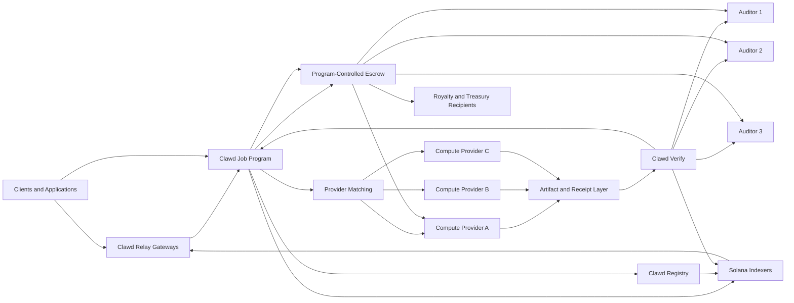
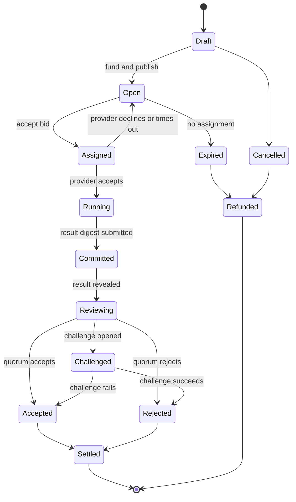

# Clawd
## Decentralized AI and Compute on Solana SVM

> Architecture and protocol specification — draft v0.1  
> Status: design document for implementation review  
> Scope: Solana-native coordination, decentralized compute, AI training, inference, evaluation, and federated learning

---

## 1. Purpose

AI infrastructure is concentrated among a small number of providers. That concentration can limit access, increase switching costs, reduce transparency, and make it difficult for developers, data owners, researchers, and independent hardware operators to participate in the value they create.

Clawd is designed as an open network where:

- clients publish AI or general compute jobs;
- independent providers compete to execute those jobs;
- auditors evaluate results under task-specific rules;
- model and data publishers register provenance and usage terms;
- applications consume models through open gateways; and
- Solana programs coordinate identity, escrow, commitments, disputes, reputation, and settlement.

Clawd does **not** attempt to run GPU workloads inside Solana transactions. Training, inference, data processing, and evaluation run in provider-controlled execution environments. Solana acts as the shared control and settlement plane.

This separation is fundamental: the SVM provides deterministic state transitions and composable payments, while the compute mesh provides the hardware and runtime capacity required by AI workloads.

---

## 2. Design goals

Clawd should provide:

1. **Open participation** — qualified hardware operators can register capabilities and compete for work.
2. **Verifiable delivery** — every accepted result is tied to an immutable job manifest, content digests, signed receipts, and a review policy.
3. **Direct settlement** — job funds are held in program-controlled escrow and released according to transparent rules.
4. **Portable artifacts** — models, adapters, datasets, evaluation reports, and runtime images are content-addressed and not locked to one gateway.
5. **Privacy-aware execution** — raw private data can remain with its owner through local execution or federated learning.
6. **Task-specific assurance** — deterministic jobs, model training, and interactive inference use different verification methods instead of one universal score.
7. **Progressive decentralization** — the first release can use a narrow, auditable program set, then distribute indexing, scheduling, auditing, and governance over time.
8. **Useful work over passive capital** — rewards come primarily from completed jobs, not from idle token ownership.

## 3. Non-goals

The first releases will not:

- place model weights, datasets, or execution logs directly on Solana;
- claim that every nondeterministic AI output can be proven cryptographically;
- guarantee privacy merely because a job is coordinated on-chain;
- rely on one static scoring formula for every workload;
- reward providers solely for registering hardware;
- require a new asset for clients to purchase compute; or
- make subjective model quality slashable without objective evidence.

---

# 4. Clawd product surfaces

Clawd is organized into five interoperable surfaces.

## 4.1 Clawd Grid

Clawd Grid is the decentralized compute mesh. It matches jobs with providers offering GPUs, CPUs, memory, storage, bandwidth, and supported runtimes.

Grid supports:

- one-time batch jobs;
- long-running training jobs;
- evaluation jobs;
- embedding and indexing jobs;
- persistent inference capacity; and
- private or locality-constrained jobs.

## 4.2 Clawd Forge

Clawd Forge manages model training, adaptation, evaluation campaigns, and federated learning rounds.

Forge supports:

- full fine-tuning or adapter tuning;
- checkpointed training;
- multi-provider training campaigns;
- hidden evaluation shards;
- model cards and training reports;
- local-data training; and
- robust aggregation of participant updates.

## 4.3 Clawd Relay

Clawd Relay exposes trained or registered models to applications through replaceable gateway operators.

Relay supports:

- request-response inference;
- streaming output;
- prepaid usage sessions;
- signed cumulative usage receipts;
- provider routing by cost, latency, region, or reputation; and
- a familiar chat and completion request shape for developer integrations.

## 4.4 Clawd Registry

Clawd Registry stores compact on-chain references for:

- models;
- adapters;
- datasets;
- runtime images;
- evaluation suites;
- provider capabilities;
- licenses and usage policies; and
- artifact lineage.

Large artifacts remain in content-addressed storage. Solana records hashes, ownership, authorities, and settlement rules.

## 4.5 Clawd Verify

Clawd Verify coordinates result commitments, auditor assignments, score commitments, challenges, and final acceptance.

It supports multiple assurance modes because verification requirements differ across workload types.

---

# 5. System architecture



## 5.1 Solana control plane

The control plane contains the authoritative state required to coordinate jobs and payments:

- protocol configuration;
- provider registrations;
- provider capability commitments;
- artifact registrations;
- job manifests and state transitions;
- bids and assignments;
- escrow balances;
- result commitments;
- auditor commitments and reveals;
- challenge records;
- settlement records; and
- reputation events.

Program Derived Addresses provide deterministic account addresses for protocol state. Large identifiers are hashed before they are used as seeds.

## 5.2 Off-chain compute plane

The compute plane contains provider-operated agents and isolated runners.

Each provider runs:

- a **Clawd Agent** that watches for eligible jobs;
- a **scheduler adapter** for local capacity;
- a **sandboxed runner** for containerized workloads;
- a **metering service** that signs resource and timing receipts;
- an **artifact client** for content-addressed uploads and downloads; and
- a **wallet signer** isolated from the workload container.

A job container never receives direct access to the provider wallet key.

## 5.3 Artifact and data plane

Artifacts are stored outside Solana and referenced by digest. A registry record may include:

- content URI;
- SHA-256 digest;
- media type;
- byte length;
- encryption metadata;
- publisher address;
- parent artifact digests;
- license identifier;
- usage constraints; and
- royalty recipients.

A URI is a retrieval hint. The digest is the identity. Gateways and providers must verify downloaded bytes before use.

## 5.4 Gateway and index plane

Gateways are replaceable services that convert developer requests into protocol operations. They may provide:

- wallet authentication;
- scoped API credentials;
- job creation helpers;
- inference routing;
- artifact upload coordination;
- Solana transaction construction;
- event indexing; and
- usage dashboards.

No gateway is protocol-authoritative. A client can submit transactions directly or switch gateway operators.

---

# 6. On-chain program design

For the first release, use a small number of Anchor programs written in Rust. Splitting every feature into a separate program increases cross-program calls, account coordination, and audit scope. The recommended first release is three programs.

## 6.1 `clawd_core`

Responsible for:

- protocol configuration;
- provider registration;
- capability records;
- jobs;
- bids;
- assignments;
- result commitments;
- review state;
- challenges;
- settlement authorization; and
- reputation events.

## 6.2 `clawd_registry`

Responsible for:

- artifact records;
- publisher authorities;
- version lineage;
- license and policy hashes;
- model and dataset metadata; and
- optional non-transferable reputation or certification badges.

## 6.3 `clawd_treasury`

Responsible for:

- payment escrow;
- job-specific provider bonds;
- auditor bonds;
- challenge bonds;
- royalty splits;
- refunds;
- protocol fees; and
- treasury withdrawals subject to governance controls.

All asset transfers use the Solana System Program or approved SPL token programs. The treasury program must verify the expected mint, token program, authorities, and recipient accounts for every transfer.

## 6.4 Recommended account model

| Account | Suggested PDA seeds | Purpose |
|---|---|---|
| ProtocolConfig | `clawd`, `config` | Global authorities, fee cap, supported token programs, pause controls |
| Provider | `provider`, provider wallet | Identity, status, aggregate reputation, bond status |
| Capability | `capability`, provider, capability digest | Hardware and runtime offer |
| Artifact | `artifact`, artifact digest | Compact artifact record and publisher authority |
| Job | `job`, creator, job nonce | Job state and immutable manifest digest |
| Bid | `bid`, job, provider | Provider quote and promised completion window |
| Assignment | `assignment`, job, provider | Accepted work order and bond requirements |
| ResultCommit | `result`, assignment | Output digest, receipt digest, reveal deadline |
| Audit | `audit`, job, auditor | Commit and reveal state for one auditor |
| Challenge | `challenge`, job, challenger | Dispute evidence and challenge bond |
| Escrow | `escrow`, job | Program authority for job funds |
| ReputationEvent | `reputation`, subject, event nonce | Append-only reputation evidence |

For high-volume event history, emit program events and keep only the current compact state on-chain. Independent indexers reconstruct timelines from transactions.

## 6.5 Core instructions

Suggested instruction surface:

```text
initialize_protocol
update_protocol_config
register_provider
update_provider
publish_capability
retire_capability
register_artifact
update_artifact_policy
create_job
fund_job
open_job
submit_bid
withdraw_bid
assign_provider
accept_assignment
commit_result
reveal_result
select_auditors
commit_audit
reveal_audit
open_challenge
submit_challenge_evidence
resolve_challenge
settle_job
cancel_job
expire_job
withdraw_refund
record_reputation_event
pause_protocol
resume_protocol
```

Administrative instructions must be separated from ordinary job instructions and protected by a multisignature authority plus a timelock.

---

# 7. Job manifest

The on-chain Job account stores compact fields and the hash of a complete manifest. The complete manifest is immutable once the job opens.

## 7.1 Example manifest

```json
{
  "schema": "clawd.job.v1",
  "kind": "model_adaptation",
  "name": "domain-support-adapter",
  "creator": "<SOLANA_ADDRESS>",
  "runtime": {
    "image_uri": "<CONTENT_ADDRESSED_URI>",
    "image_digest": "sha256:<DIGEST>",
    "entrypoint": ["python", "train.py"]
  },
  "inputs": [
    {
      "name": "training_data",
      "uri": "<ENCRYPTED_OR_PUBLIC_URI>",
      "digest": "sha256:<DIGEST>",
      "mount": "/clawd/input/train"
    }
  ],
  "outputs": [
    {
      "name": "adapter",
      "path": "/clawd/output/adapter",
      "media_type": "application/x-model-adapter"
    },
    {
      "name": "model_card",
      "path": "/clawd/output/model-card.json",
      "media_type": "application/json"
    }
  ],
  "resources": {
    "gpu_count": 1,
    "minimum_vram_gib": 24,
    "cpu_cores": 8,
    "memory_gib": 64,
    "disk_gib": 200,
    "maximum_runtime_seconds": 21600
  },
  "network": {
    "egress": "restricted",
    "allowed_hosts": ["<APPROVED_ARTIFACT_HOST>"]
  },
  "acceptance": {
    "policy": "hidden_evaluation",
    "metric": "task_score",
    "minimum": 0.78,
    "auditor_quorum": 3,
    "challenge_window_seconds": 7200
  },
  "payment": {
    "mint": "<PAYMENT_MINT_OR_SOL>",
    "provider_budget": "250000000",
    "auditor_budget": "25000000",
    "royalties": [
      {"recipient": "<PUBLISHER_ADDRESS>", "basis_points": 200}
    ]
  },
  "privacy": {
    "classification": "restricted",
    "log_policy": "redacted",
    "artifact_encryption": "required"
  },
  "deadlines": {
    "bid_end_unix": 1800000000,
    "accept_by_unix": 1800003600,
    "result_by_unix": 1800025200
  }
}
```

## 7.2 Manifest rules

A valid manifest must:

- use a recognized schema version;
- identify every executable image by digest;
- identify every input by digest or encrypted object commitment;
- specify output paths and media types;
- specify resource limits;
- define an acceptance policy before bidding;
- define all deadlines;
- define payment and bond assets;
- keep royalty totals within the protocol cap;
- declare network access policy; and
- declare whether logs or artifacts may contain sensitive data.

The creator cannot change acceptance thresholds, runtime digests, inputs, or payment rules after the job opens. A changed job requires a new manifest and Job account.

---

# 8. Participants

## 8.1 Clients

Clients create and fund jobs. A client may be an individual, application, model publisher, data owner, research group, or autonomous agent.

Responsibilities:

- publish an accurate manifest;
- fund the job and auditor budget;
- provide accessible inputs or valid decryption flow;
- avoid prohibited or unlawful workloads;
- define objective acceptance rules where possible; and
- participate in disputes when the policy requires client evidence.

## 8.2 Compute providers

Compute providers execute jobs using registered hardware and runtimes.

Responsibilities:

- publish truthful capabilities;
- quote price and completion windows;
- post the required performance bond;
- execute the exact runtime digest;
- isolate workloads;
- protect wallet keys and client secrets;
- submit result and receipt commitments before deadlines; and
- retain challenge evidence for the stated period.

Provider selection is not determined by capital alone. Matching considers capability, bid, reliability, specialization, geographic constraints, and diversity requirements.

## 8.3 Auditors

Auditors independently evaluate submitted results. Clawd auditors are distinct from Solana consensus validators.

Responsibilities:

- obtain the assigned evaluation package;
- run the required evaluator or reproduction check;
- commit a score or verdict before seeing other reveals;
- reveal within the review window;
- provide evidence when challenging a result; and
- avoid evaluating jobs where they have a disclosed conflict.

Auditors post a job-specific bond. Consistently late, random, copied, or collusive reviews reduce reputation and may lose a bond when objective evidence exists.

## 8.4 Artifact publishers

Artifact publishers register models, datasets, evaluation suites, and runtime images.

They define:

- artifact identity and lineage;
- usage license;
- access policy;
- integrity digest;
- deprecation status;
- royalty terms; and
- security or safety notes.

## 8.5 Gateway operators

Gateway operators provide developer-facing APIs and routing. They do not control protocol funds or final job state.

## 8.6 Indexer operators

Indexer operators ingest Solana transactions and expose searchable views of jobs, providers, artifacts, audits, and reputation events. Multiple independent indexers should be supported from the start.

## 8.7 No delegation role in the first release

Clawd does not need a passive delegation layer for its first release. Job-specific bonds create direct accountability between the party doing the work and the party being paid. Delegation can be reconsidered only after the network has reliable work demand, clear slashing evidence, and a legal review.

---

# 9. Supported job types

## 9.1 Batch compute

Examples:

- rendering;
- simulation;
- data transformation;
- compilation;
- embedding generation; and
- evaluation sweeps.

Preferred assurance: deterministic replay, output digest checks, or redundant execution.

## 9.2 Model adaptation

Examples:

- supervised fine-tuning;
- adapter training;
- preference optimization;
- domain adaptation; and
- quantization.

Preferred assurance: hidden evaluation shards, training report checks, artifact integrity, and optional redundant evaluation.

## 9.3 Model evaluation

Examples:

- accuracy or quality benchmarks;
- safety evaluations;
- latency and throughput tests;
- regression testing; and
- adversarial test suites.

Preferred assurance: auditor commit and reveal, evaluator image digest, hidden shards, and result reproducibility.

## 9.4 Interactive inference

Examples:

- chat;
- text generation;
- image or audio generation;
- transcription;
- classification; and
- agent tool execution.

Preferred assurance: signed session receipts, request and response commitments when permitted, spot audits, availability measurements, and provider reputation.

## 9.5 Federated learning

Participants train locally and share updates rather than raw private data.

Preferred assurance: update commitments, norm bounds, secure aggregation where required, robust aggregation, hidden evaluation, and round-level challenge rules.

## 9.6 Persistent services

Providers reserve capacity for a defined period. Settlement uses cumulative signed usage receipts rather than one transaction per request.

---

# 10. Job lifecycle



## 10.1 Create and fund

The client uploads the complete manifest, computes its digest, creates the Job account, and deposits:

- provider payment budget;
- auditor budget;
- royalty budget if separate; and
- any client bond required by the selected job policy.

## 10.2 Bid and match

Providers submit bids containing:

- price;
- estimated start time;
- estimated completion time;
- capability record;
- assurance modes supported; and
- bid expiry.

The client may select a bid directly, use an automated policy, or use a sealed-bid extension for high-value jobs.

## 10.3 Accept and bond

The selected provider accepts the assignment and deposits the required performance bond. If the provider does not accept before the deadline, the assignment expires and the job can reopen.

## 10.4 Execute

The Clawd Agent:

1. downloads the runtime and inputs;
2. verifies every digest;
3. prepares an isolated execution environment;
4. applies network and resource limits;
5. launches the workload;
6. collects signed metering events;
7. uploads outputs and redacted logs; and
8. constructs a result receipt.

## 10.5 Commit and reveal

Before the result deadline, the provider submits a commitment to:

- output digest set;
- receipt digest;
- optional evaluation digest;
- reveal nonce; and
- completion timestamp.

The provider then reveals the artifact references and nonce. The program verifies the commitment.

## 10.6 Audit

Assigned auditors first commit their verdict or score, then reveal. The program rejects late or inconsistent reveals.

Aggregation is policy-specific:

- majority verdict for binary deterministic checks;
- median or trimmed mean for numeric scores;
- threshold plus quorum for model evaluation;
- reproduction match for deterministic jobs; or
- attestation policy for confidential jobs.

## 10.7 Challenge

During the challenge window, an eligible challenger posts a bond and submits evidence. The resolution path may require:

- independent re-execution;
- a larger auditor quorum;
- deterministic artifact inspection;
- receipt signature verification;
- runtime digest verification; or
- client-side evidence for private inputs.

A successful challenger receives the challenge bond back plus a configured reward. A failed challenger loses some or all of the challenge bond to auditors and the affected provider.

## 10.8 Settle

Settlement distributes funds according to the immutable manifest and final verdict:

- accepted provider payment;
- auditor rewards;
- model or data royalties;
- protocol fee;
- challenge rewards or penalties; and
- unused funds returned to the client.

Reputation events are emitted after settlement.

---

# 11. Verification framework

No single verification technique is suitable for every AI workload. Clawd defines assurance profiles.

## 11.1 Profile A — optimistic delivery

Use for low-value or trusted-counterparty jobs.

Controls:

- signed result receipt;
- content digests;
- short challenge window;
- provider reputation; and
- no mandatory auditor quorum.

## 11.2 Profile B — independent audit

Use for ordinary model, evaluation, and batch jobs.

Controls:

- provider commitment and reveal;
- multiple auditors;
- auditor commitment and reveal;
- hidden evaluator inputs; and
- challenge window.

## 11.3 Profile C — redundant execution

Use for deterministic or high-value jobs.

Controls:

- two or more providers execute independently;
- output digests or tolerance-aware comparisons are evaluated;
- a tie-break execution is triggered on disagreement; and
- correlated infrastructure may be excluded from one quorum.

## 11.4 Profile D — confidential attestation

Use when client data or model weights cannot be exposed to ordinary auditors.

Controls may include:

- hardware-backed execution attestation;
- encrypted inputs released only to approved measurements;
- signed runtime identity;
- restricted logs;
- client-verifiable receipt; and
- a narrow challenge policy.

Attestation proves properties of the measured environment. It does not automatically prove model quality, correct client code, or freedom from side channels.

## 11.5 Profile E — advanced proof adapter

A future adapter may accept succinct computation proofs for compatible workloads. The protocol should define a generic verifier interface without making the first release dependent on proof systems that do not yet support the full workload.

## 11.6 Result receipt

A canonical receipt should contain:

```json
{
  "schema": "clawd.receipt.v1",
  "job": "<JOB_ADDRESS>",
  "assignment": "<ASSIGNMENT_ADDRESS>",
  "provider": "<PROVIDER_ADDRESS>",
  "manifest_digest": "sha256:<DIGEST>",
  "runtime_digest": "sha256:<DIGEST>",
  "input_digests": ["sha256:<DIGEST>"],
  "output_digests": ["sha256:<DIGEST>"],
  "started_at_unix": 1800004000,
  "finished_at_unix": 1800019000,
  "resource_class": "gpu-24g",
  "metering_digest": "sha256:<DIGEST>",
  "attestation_digest": null,
  "nonce": "<RANDOM_NONCE>",
  "signature": "<PROVIDER_SIGNATURE>"
}
```

A receipt is evidence of a signed claim. It becomes stronger when combined with independent audit, redundant execution, or attestation.

---

# 12. Model training design

## 12.1 Training campaign

A training campaign is a parent record that links multiple jobs and checkpoints. It defines:

- starting model artifact;
- model license;
- training objective;
- accepted training methods;
- data policy;
- evaluation suite;
- checkpoint cadence;
- total budget;
- maximum campaign duration; and
- final selection rule.

## 12.2 Checkpoint flow

For long jobs, providers submit periodic checkpoint commitments. Checkpoints provide:

- progress visibility;
- restart points;
- evidence for no-show disputes;
- early detection of invalid runs; and
- optional partial payment milestones.

A checkpoint commitment is not a complete proof of training. It is a signed, immutable progress claim tied to artifact digests and logs.

## 12.3 Candidate selection

Final candidates are evaluated using one or more of:

- hidden quality shards;
- public benchmark suites;
- task-specific safety tests;
- latency and memory constraints;
- license compliance checks;
- artifact format checks; and
- human review where the manifest explicitly permits subjective review.

Subjective review scores must not trigger automatic slashing unless fraud or protocol violation is objectively demonstrated.

## 12.4 Model publication

An accepted model or adapter receives a Registry record containing:

- artifact digest;
- parent model digest;
- training campaign address;
- runtime requirements;
- evaluation report digests;
- model card digest;
- license identifier;
- publisher authority; and
- optional royalty split.

---

# 13. Federated learning design

Clawd supports collaborative training while allowing participants to keep raw data local.

## 13.1 Round roles

Each round has:

- a **campaign creator**;
- **local trainers** that compute updates;
- one or more **aggregators**;
- **auditors** that evaluate the aggregate; and
- an optional **privacy coordinator** for secure aggregation setup.

## 13.2 Round lifecycle

1. The creator publishes the round manifest and starting checkpoint digest.
2. Eligible local trainers enroll and post a bond.
3. Trainers download the approved runtime and starting checkpoint.
4. Training runs locally against private data.
5. Each trainer clips the update according to the manifest.
6. Trainers commit update digests before reveal or encrypted submission.
7. The aggregator applies the declared aggregation method.
8. Auditors evaluate the aggregate against hidden or public evaluation data.
9. Accepted aggregate artifacts become the next round checkpoint.
10. Rewards are distributed according to accepted contribution evidence and round policy.

## 13.3 Aggregation policies

Supported policies may include:

- weighted mean;
- trimmed mean;
- coordinate-wise median;
- norm-clipped mean;
- trust-weighted aggregation; and
- secure aggregation where individual updates remain hidden.

The policy and all parameters are fixed in the round manifest.

## 13.4 Poisoning controls

- update norm limits;
- similarity and outlier analysis;
- hidden evaluation before acceptance;
- contribution caps per identity;
- provider and dataset diversity constraints;
- delayed reward for high-risk rounds;
- challenge sampling; and
- exclusion after repeated harmful updates.

Raw local data never needs to be uploaded to the protocol. Participants must still assess whether model updates could leak private information and may enable differential privacy or secure aggregation where appropriate.

---

# 14. Interactive inference and usage settlement

Writing one Solana transaction for every generated response would create unnecessary latency and cost. Clawd Relay therefore uses prepaid sessions and cumulative receipts.

## 14.1 Session lifecycle

1. A client opens a session and deposits a spending limit.
2. A gateway routes requests to an eligible provider.
3. The provider returns output plus a signed usage receipt.
4. The client or gateway acknowledges a cumulative usage total.
5. Either party periodically submits the latest mutually signed total.
6. The session closes when the limit, expiry, or client request is reached.
7. The program pays the provider and refunds unused funds.

## 14.2 Cumulative usage receipt

```json
{
  "schema": "clawd.usage.v1",
  "session": "<SESSION_ADDRESS>",
  "sequence": 42,
  "provider": "<PROVIDER_ADDRESS>",
  "model_digest": "sha256:<DIGEST>",
  "input_units_total": 128400,
  "output_units_total": 31200,
  "compute_milliseconds_total": 934000,
  "amount_due_total": "18250000",
  "previous_receipt_digest": "sha256:<DIGEST>",
  "provider_signature": "<SIGNATURE>",
  "client_signature": "<SIGNATURE>"
}
```

Only the latest valid cumulative total needs to settle. Earlier receipts remain evidence for disputes.

## 14.3 Routing policy

A client may request routing by:

- lowest quoted cost;
- maximum reputation;
- geographic region;
- latency target;
- privacy capability;
- specific provider allowlist;
- specific model digest; or
- diversified provider rotation.

Gateways must disclose their routing policy and any gateway fee.

---

# 15. Economics

## 15.1 Payment assets

Clients can pay in SOL or approved SPL assets. A new network asset is not required for product-market validation.

An optional CLAWD asset may later be used for governance, bonds, or ecosystem incentives after technical, economic, and legal review. Job payments should remain open to approved assets so compute demand is not dependent on one volatile asset.

## 15.2 Job funding

Every job separates:

- provider budget;
- auditor budget;
- royalty budget;
- protocol fee allowance;
- client bond if required; and
- provider or challenger bond requirements.

This separation makes settlement understandable and prevents hidden deductions from provider quotes.

## 15.3 Protocol fee

The protocol fee is stored in ProtocolConfig with:

- a hard program-enforced maximum;
- a timelocked update path;
- a public effective timestamp; and
- no retroactive application to open jobs.

A reasonable launch target is a low single-digit fee. The exact value should be chosen after infrastructure costs and demand are measured.

## 15.4 Provider rewards

Providers earn:

- accepted bid payment;
- milestone payments where enabled;
- availability reservation payments for persistent services; and
- optional quality or early-completion bonuses defined before bidding.

## 15.5 Auditor rewards

Auditors are paid from an explicit job budget. Reward calculation may consider:

- timely commit and reveal;
- agreement with the final reproducible outcome;
- useful challenge evidence;
- specialization; and
- historical reliability.

Auditors should not be rewarded merely for copying the majority. Hidden inputs, commit and reveal, and occasional canary jobs help measure independent work.

## 15.6 Bonds and penalties

Bonds are job-specific and risk-proportional. Slashable events must be objectively testable, such as:

- accepting a job and failing to start before the deadline;
- conflicting signed commitments;
- revealing artifacts that do not match the commitment;
- forged or invalid receipt signatures;
- failing a deterministic re-execution challenge; or
- revealing a score different from the committed score.

Poor quality alone is not automatically fraud. A provider may simply fail the acceptance threshold and receive no success payment.

## 15.7 Royalties

A manifest may allocate a capped share to registered model or data publishers. Every royalty recipient and share is visible before providers bid.

Royalties must not bypass artifact license terms or imply ownership of data that the publisher does not control.

---

# 16. Reputation

Reputation is protocol evidence, not a transferable financial asset.

## 16.1 Dimensions

Maintain separate dimensions for:

- delivery reliability;
- audit reliability;
- deterministic correctness;
- model training quality;
- inference availability;
- challenge success rate;
- dispute rate;
- task specialization; and
- recent activity.

A single global number hides too much information. Matching should use the dimensions relevant to the job.

## 16.2 Reputation events

Events include:

- assignment accepted;
- completed on time;
- accepted result;
- rejected result;
- successful challenge;
- failed challenge;
- late audit;
- invalid reveal;
- availability period completed; and
- verified capability update.

## 16.3 Decay and recovery

Old performance gradually loses weight. Providers can recover from ordinary failures through later successful work, while cryptographic fraud or repeated protocol violations retain stronger penalties.

## 16.4 Optional credential badge

Token-2022 non-transferable tokens may represent reviewed capability tiers or training completion. The authoritative evidence remains the Registry and reputation history; a badge is only a convenient credential.

---

# 17. Security model

| Threat | Risk | Clawd controls |
|---|---|---|
| Sybil identities | One operator creates many identities to influence matching or audits | Job-specific bonds, reputation aging, capability verification, diversity constraints, diminishing assignment concentration, optional identity attestations |
| Job spam and denial of service | Attackers create jobs or bids that consume indexer and provider resources | Creation deposits, rate limits at gateways, minimum funded budgets, bid limits, account-size limits, expiration and cleanup incentives |
| Provider no-show | A provider accepts work but never executes | Acceptance deadline, performance bond, automatic expiry, reputation event, reassignment |
| Result substitution | Provider reveals different bytes than committed | Content digests, commit and reveal, runtime image digest, immutable manifest |
| Free-riding auditor | Auditor submits random or copied scores | Commit and reveal, hidden shards, canary jobs, outlier analysis, minimum evidence, reputation penalties |
| Provider-auditor collusion | Related parties approve invalid work | Randomized assignment from eligible pools, conflict disclosures, infrastructure diversity, larger quorum for valuable jobs, challenge market |
| Training-data or update poisoning | Malicious updates degrade a shared model | Norm clipping, robust aggregation, hidden evaluation, contribution caps, delayed settlement, exclusion rules |
| Evaluation lookup | Provider overfits known evaluator data | Hidden shards, rotating evaluators, two-stage public and private checks, manifest-bound scoring |
| Randomness manipulation | Assignment or auditor selection is predictable or influenceable | Verifiable randomness integration or delayed commit and reveal beacon; do not use timestamps or recent hashes alone for valuable selection |
| Artifact supply-chain attack | Runtime or dependency is modified | Immutable image digests, signed publisher records, software bill of materials, restricted network policy, reproducible builds where possible |
| Secret leakage | Workload reads provider keys or unrelated client data | Isolated runner, no wallet key in container, scoped secrets, encrypted artifacts, redacted logs, per-job storage |
| Metering fraud | Provider exaggerates resource usage | Fixed-price bids where practical, cumulative signed receipts, client countersignature, hardware telemetry sampling, caps in manifest |
| Challenge spam | Attackers repeatedly delay settlement | Challenge bond, evidence requirements, limited challenge window, escalating bond for repeated failed challenges |
| Upgrade compromise | Program authority deploys malicious code | Multisignature, timelock, verified builds, emergency pause separated from upgrade authority, public upgrade notice |
| Indexer censorship | One interface hides jobs or participants | Multiple indexers, direct RPC access, open event schema, client-side verification of on-chain state |

## 17.1 Security principles

- Never use pseudo-random values derived only from easily influenced transaction fields for high-value committee selection.
- Never allow a gateway signature to replace the required provider or client signature.
- Never release escrow using an off-chain status flag without matching on-chain evidence.
- Never pass provider wallet secrets into untrusted workload containers.
- Never slash on an ambiguous or subjective claim without an explicit adjudication policy.
- Never treat a hardware attestation as proof that a model is accurate or safe.

---

# 18. Privacy and data governance

## 18.1 Data minimization

Solana records only the information needed for coordination and settlement. Private prompts, raw datasets, model weights, and detailed logs should not be placed on-chain.

## 18.2 Encryption

Restricted inputs and outputs should use:

- per-job encryption keys;
- recipient-specific key wrapping;
- expiring access grants;
- encrypted object storage;
- digest verification after decryption; and
- key deletion workflows after retention periods.

## 18.3 Local execution

For sensitive data, the data owner can operate a local trainer or local auditor. Only update commitments, aggregate artifacts, and allowed metrics leave the local environment.

## 18.4 Logging

Every manifest declares one of:

- full logs permitted;
- redacted logs only;
- metrics only; or
- no retained logs.

Providers must not retain private inputs beyond the declared retention window.

## 18.5 Provenance

Every published artifact can link to parent artifacts and campaign records. Provenance does not by itself establish legal rights; publishers remain responsible for accurate license and ownership claims.

---

# 19. Program governance and upgrade safety

## 19.1 Launch authority

At launch, use a multisignature upgrade authority with:

- independent signers;
- hardware-backed keys;
- a public signer policy;
- a timelock for ordinary upgrades; and
- a separate limited emergency pause authority.

## 19.2 Verified deployments

Every production program should have a verified build tied to a public source revision. Release artifacts, IDLs, program addresses, and audit reports should be published together.

## 19.3 Progressive decentralization

Suggested sequence:

1. multisignature-controlled devnet release;
2. external program audit;
3. mainnet release with fee and limit caps;
4. public upgrade queue and timelock;
5. broader governance over non-emergency configuration; and
6. optional removal of upgrade authority for mature, narrowly scoped programs.

## 19.4 Emergency controls

A pause should stop new jobs and risky settlement paths while preserving:

- withdrawals of undisputed refunds;
- reading all state;
- challenge evidence submission where safe; and
- a bounded path to resolve already accepted work.

---

# 20. API and authentication

## 20.1 Authentication

Primary identity is a Solana wallet signature.

Gateway login flow:

1. client requests a nonce;
2. gateway returns domain, nonce, expiry, and requested scopes;
3. wallet signs the exact message;
4. gateway verifies the signature and current on-chain status; and
5. gateway issues a short-lived scoped session token.

Long-lived developer keys may be created from a signed session, but they should be revocable, scoped, rate-limited, and never used as on-chain authority.

## 20.2 Suggested endpoints

```text
POST   /v1/auth/nonce
POST   /v1/auth/verify
GET    /v1/providers
GET    /v1/artifacts
POST   /v1/artifacts
POST   /v1/jobs
GET    /v1/jobs/{job}
GET    /v1/jobs/{job}/bids
POST   /v1/jobs/{job}/bids
POST   /v1/jobs/{job}/assign
POST   /v1/jobs/{job}/results
POST   /v1/jobs/{job}/audits
POST   /v1/jobs/{job}/challenges
POST   /v1/inference/sessions
POST   /v1/chat/completions
POST   /v1/inference/responses
GET    /v1/inference/sessions/{session}
```

## 20.3 Example job submission

```ts
const endpoint = process.env.CLAWD_API_URL;
const token = process.env.CLAWD_SESSION_TOKEN;

if (!endpoint || !token) {
  throw new Error("Missing CLAWD_API_URL or CLAWD_SESSION_TOKEN");
}

const manifest = {
  schema: "clawd.job.v1",
  kind: "batch_compute",
  name: "embedding-run",
  runtime: {
    image_uri: "<CONTENT_ADDRESSED_URI>",
    image_digest: "sha256:<DIGEST>",
    entrypoint: ["python", "run.py"]
  },
  resources: {
    gpu_count: 1,
    minimum_vram_gib: 16,
    cpu_cores: 4,
    memory_gib: 32,
    disk_gib: 100,
    maximum_runtime_seconds: 3600
  },
  acceptance: {
    policy: "independent_audit",
    auditor_quorum: 3,
    challenge_window_seconds: 3600
  }
};

const response = await fetch(`${endpoint}/v1/jobs`, {
  method: "POST",
  headers: {
    authorization: `Bearer ${token}`,
    "content-type": "application/json"
  },
  body: JSON.stringify({ manifest })
});

if (!response.ok) {
  throw new Error(`Job creation failed: ${response.status} ${await response.text()}`);
}

const result = await response.json();
console.log(result);
```

A production gateway should return an unsigned or partially signed Solana transaction for the client wallet to inspect and authorize. The gateway must not silently become the client’s custodian.

---

# 21. Developer and node setup

The commands below define the intended developer experience. Repository placeholders must be replaced with the project’s actual locations before publishing operational documentation.

## 21.1 Solana development tools

Current Solana documentation provides a quick installer for Rust, Solana CLI, Anchor, and related tools:

```bash
curl --proto '=https' --tlsv1.2 -sSfL https://solana-install.solana.workers.dev | bash
```

Verify the installation:

```bash
rustc --version
solana --version
anchor --version
node --version
```

Configure devnet and create a development wallet:

```bash
solana config set --url devnet
solana-keygen new --outfile ~/.config/solana/clawd-devnet.json
solana config set --keypair ~/.config/solana/clawd-devnet.json
solana airdrop 2
```

For Windows hosts, use WSL2 for program development and a GPU-compatible container environment for provider workloads.

## 21.2 Provider host prerequisites

Recommended:

- Linux or WSL2;
- Docker or another OCI-compatible runtime;
- vendor GPU drivers and container integration;
- 100 GB or more free disk for test workloads;
- outbound access to configured artifact stores;
- an RPC endpoint with websocket support;
- an isolated provider keypair; and
- monitoring for GPU, disk, process, and network health.

## 21.3 Suggested provider installation

```bash
git clone <CLAWD_AGENT_REPOSITORY>
cd clawd-agent
cp config/example.toml config/provider.toml
cargo build --release
```

Example configuration:

```toml
cluster = "devnet"
rpc_url = "${SOLANA_RPC_URL}"
websocket_url = "${SOLANA_WS_URL}"
provider_keypair = "/secure/keys/clawd-provider.json"
work_dir = "/var/lib/clawd/jobs"
artifact_cache_dir = "/var/lib/clawd/artifacts"
max_concurrent_jobs = 1

[runner]
runtime = "docker"
network_default = "restricted"
wallet_mount = "disabled"
read_only_root = true

[capabilities]
gpu_count = 1
gpu_memory_gib = 24
cpu_cores = 16
memory_gib = 64
disk_gib = 500
regions = ["us-east"]
job_kinds = ["batch_compute", "model_adaptation", "model_evaluation"]

[metering]
sign_receipts = true
sample_interval_seconds = 5
```

Suggested CLI flow:

```bash
clawd provider register --config config/provider.toml
clawd provider publish-capability --config config/provider.toml
clawd provider deposit-bond --amount <AMOUNT> --mint <MINT_OR_SOL>
clawd-agent run --config config/provider.toml
```

## 21.4 Auditor setup

```bash
git clone <CLAWD_AUDITOR_REPOSITORY>
cd clawd-auditor
cp config/example.toml config/auditor.toml
cargo build --release
clawd auditor register --config config/auditor.toml
clawd-auditor run --config config/auditor.toml
```

Auditor configuration declares:

- supported evaluator images;
- maximum model size;
- GPU and CPU capacity;
- accepted privacy modes;
- maximum concurrent reviews; and
- minimum auditor fee.

## 21.5 Client flow

```bash
clawd artifact publish manifest.json
clawd job create manifest.json --fund
clawd job bids <JOB_ADDRESS>
clawd job assign <JOB_ADDRESS> --provider <PROVIDER_ADDRESS>
clawd job status <JOB_ADDRESS> --watch
clawd job settle <JOB_ADDRESS>
```

These command names are a proposed interface, not a claim that a released binary already exists.

---

# 22. Suggested source tree

```text
clawd/
├── programs/
│   ├── clawd-core/
│   ├── clawd-registry/
│   └── clawd-treasury/
├── crates/
│   ├── manifest/
│   ├── receipt/
│   ├── policy-engine/
│   ├── artifact-client/
│   └── solana-client/
├── services/
│   ├── gateway/
│   ├── indexer/
│   ├── scheduler/
│   └── event-worker/
├── agents/
│   ├── provider/
│   ├── auditor/
│   └── federated-trainer/
├── runners/
│   ├── oci-runner/
│   ├── evaluator-runner/
│   └── confidential-runner/
├── sdk/
│   ├── typescript/
│   ├── python/
│   └── rust/
├── schemas/
│   ├── job-v1.json
│   ├── receipt-v1.json
│   ├── usage-v1.json
│   └── artifact-v1.json
├── tests/
│   ├── program-tests/
│   ├── integration/
│   ├── adversarial/
│   └── load/
└── docs/
    ├── architecture.md
    ├── provider-guide.md
    ├── auditor-guide.md
    ├── client-guide.md
    ├── security.md
    └── protocol-parameters.md
```

For new TypeScript work, use the current recommended Solana SDK rather than building new integrations around a legacy client library.

---

# 23. Minimum viable release

## 23.1 Release 0 — local and devnet vertical slice

Deliver:

- one Anchor workspace with core, registry, and treasury programs;
- fixed-price batch jobs;
- SOL escrow;
- provider registration;
- open bids;
- provider result commitment and reveal;
- one deterministic evaluator;
- three-auditor commit and reveal;
- challenge window;
- provider and auditor reputation events;
- provider agent using OCI containers;
- gateway and indexer; and
- TypeScript client library.

Do not add a network asset, delegation, complex inflation, or subjective model contests yet.

## 23.2 Release 1 — AI workloads

Add:

- model and dataset Registry types;
- adapter training template;
- checkpoint commitments;
- hidden evaluation packages;
- model card schema;
- royalty splits;
- GPU capability verification; and
- persistent inference sessions.

## 23.3 Release 2 — federated and private workloads

Add:

- federated campaign and round records;
- robust aggregation policies;
- encrypted artifact exchange;
- secure aggregation adapter;
- confidential execution adapter; and
- privacy-focused audit policies.

## 23.4 Release 3 — distributed assurance

Add:

- sealed bids;
- verifiable randomness integration;
- redundant execution policies;
- independent gateway operators;
- independent indexers;
- advanced proof adapter; and
- governance expansion.

---

# 24. Testing requirements

## 24.1 Program tests

Test every instruction for:

- signer requirements;
- account ownership;
- PDA derivation;
- token mint and token program checks;
- integer overflow;
- duplicate settlement;
- deadline boundaries;
- unauthorized state changes;
- paused-state behavior;
- refund correctness; and
- malicious account substitution.

## 24.2 Adversarial integration tests

Simulate:

- provider no-show;
- invalid commitment reveal;
- auditor non-reveal;
- two colluding auditors;
- false challenge;
- valid challenge;
- expired job;
- royalty overflow attempt;
- wrong token mint;
- gateway censorship;
- runtime image substitution;
- duplicate receipt sequence; and
- inference session replay.

## 24.3 Economic simulations

Model:

- provider concentration;
- bond sizing;
- auditor participation;
- challenge profitability;
- collusion cost;
- fee sensitivity;
- demand spikes; and
- low-demand periods.

## 24.4 Operational tests

Measure:

- RPC failure recovery;
- websocket reconnect behavior;
- artifact retry and digest verification;
- container cleanup;
- GPU memory cleanup;
- disk exhaustion controls;
- key isolation; and
- indexer reorganization handling.

---

# 25. Replacement map for the supplied material

| Legacy concept | Clawd replacement | Reason |
|---|---|---|
| Branded model competition area | Clawd Forge plus Clawd Verify | Separates training from objective review and disputes |
| Branded federated subsystem | Federated campaigns inside Clawd Forge | Uses one job, artifact, bond, and settlement model |
| Branded model store | Clawd Registry plus Clawd Relay | Separates artifact provenance from live serving |
| Training node | Compute provider | Covers AI and general compute workloads |
| Validator role | Auditor | Avoids confusion with Solana consensus validators |
| Delegator | Removed from initial design | Direct job bonds are simpler and create clearer accountability |
| Legacy smart-contract suite | Anchor programs written in Rust | Native Solana and SVM implementation |
| Chain-specific fungible contract | SOL and approved SPL assets | Composable Solana payments without requiring a new asset |
| Central API key as protocol identity | Wallet challenge signature plus scoped gateway credentials | Keeps authority with the wallet and allows gateway replacement |
| One daily reward batch | Per-job or per-session settlement | Rewards actual completed work and reduces unrelated inflation |
| Public model URL as identity | Content digest plus Registry record | Prevents artifact substitution and enables portable storage |
| Stake-weighted work selection | Capability, bid, reputation, diversity, and job policy | Capital alone should not determine compute quality |
| Majority vote for every dispute | Task-specific assurance profiles | Different workloads require different evidence |

---

# 26. Decisions required before implementation

The team should explicitly decide:

1. Which payment assets are accepted at launch?
2. What is the maximum protocol fee enforced by program logic?
3. What bond formula applies to providers, auditors, and challengers?
4. Which artifact storage networks or services are supported first?
5. Which randomness provider or delayed beacon design selects auditors?
6. Which job types are permitted on the first public network?
7. Which workloads require identity or hardware review?
8. Which evaluator image formats and model formats are supported?
9. How long are result artifacts and challenge evidence retained?
10. Which conditions allow emergency pause, and which withdrawals remain available?
11. Does the first release need an optional CLAWD asset at all?
12. Which governance actions require a timelock, and how long is it?
13. Which regions or workload classes require additional compliance controls?
14. Which gateway compatibility envelope is supported for inference clients?
15. Which parts of provider capability data are public, private, or attested?

---

# 27. Launch checklist

Before a public mainnet release:

- [ ] Freeze manifest, receipt, artifact, and usage schemas for v1.
- [ ] Complete external security review of all programs.
- [ ] Publish verified builds and program addresses.
- [ ] Run adversarial and economic simulations.
- [ ] Document every slashable condition with objective evidence.
- [ ] Set program-enforced fee and bond caps.
- [ ] Separate upgrade, pause, and treasury authorities.
- [ ] Implement multiple RPC and artifact retrieval paths.
- [ ] Publish provider sandbox and secret-handling requirements.
- [ ] Publish data retention and privacy policies.
- [ ] Add client-side transaction simulation and human-readable summaries.
- [ ] Test refunds and dispute handling under paused conditions.
- [ ] Launch a bug bounty before meaningful value is escrowed.
- [ ] Confirm project name, domains, source organization, and asset ticker are legally and operationally clear.

---

# 28. Technical references

- [Solana core concepts](https://solana.com/docs/core)
- [Program Derived Addresses](https://solana.com/docs/core/pda)
- [Solana compute budget](https://solana.com/docs/core/fees/compute-budget)
- [Token extensions](https://solana.com/docs/tokens/extensions)
- [Solana program verification](https://solana.com/docs/programs/verified-builds)
- [Solana TypeScript SDK guidance](https://solana.com/docs/clients/official/javascript)
- [Solana developer installation](https://solana.com/docs/intro/installation)
- [Anchor documentation](https://www.anchor-lang.com/docs)

---

# 29. Summary

Clawd is a Solana-native coordination and settlement protocol for decentralized AI and compute. Its central design choice is to keep expensive workloads in provider execution environments while using SVM programs for transparent state, escrow, commitments, challenges, reputation, and payment.

The initial network should focus on a narrow, working loop:

1. publish a content-addressed job;
2. fund escrow;
3. select a qualified provider;
4. execute in an isolated runner;
5. commit and reveal results;
6. audit under a task-specific policy;
7. allow a bounded challenge; and
8. settle providers, auditors, and rights holders.

Once that loop is reliable, Clawd can expand into model adaptation, persistent inference, federated learning, confidential execution, and stronger proof adapters without replacing its core job and settlement model.
